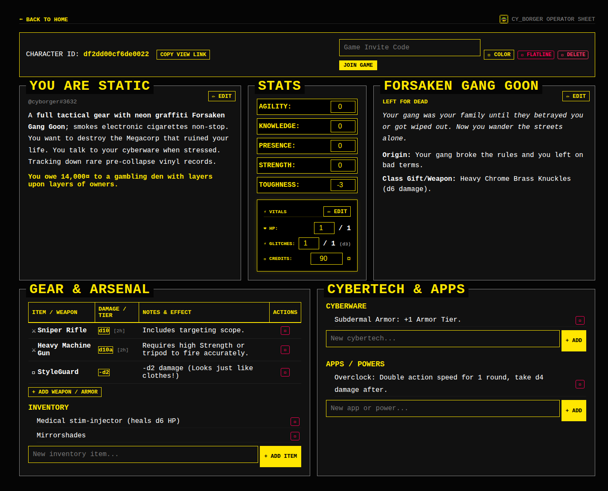
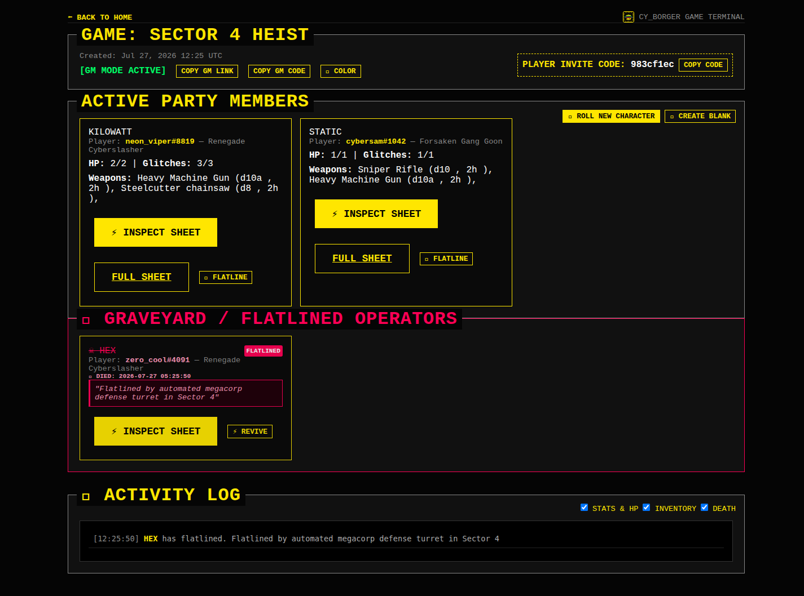
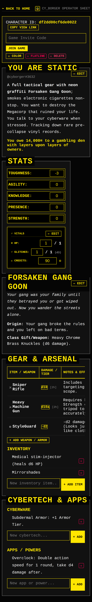

# CY_BORGER ⚡

A lightning-fast, cyberpunk-themed character generator and campaign manager built with Go, HTMX, and SQLite.

CY_BORGER is designed for the [CY_BORG](https://freeleaguepublishing.com/games/cy_borg/) tabletop roleplaying game. 

## Check it out!
**🔗 It's alive! at [https://cy-borger.poundsigndesign.com/game/cedf07b275d9](https://cy-borger.poundsigndesign.com/game/cedf07b275d9)**

`user: demo, pass: demo`

## Features

- **Character Generation & Management**: Instantly roll fully fleshed-out cyberpunk operators, edit stats, track HP/glitches, and manage inventory.
- **Campaign Management**: Create shared game lobbies where GMs can oversee active party members and manage flatlined characters in the graveyard.
- **Real-Time Activity Log**: Live-streaming event terminal in the Game View that automatically logs stat updates, inventory changes, and operator flatlines without page refresh.
- **Real-Time Sync**: Instant live updating from your party members during campaign sessions. When an operator takes damage or flatlines, everyone sees it immediately.
- **Cyberpunk Aesthetic**: Highly thematic dark mode UI with neon accents and glitch elements.

## Interface Showcase

| Desktop Operator Sheet | Game Terminal & Graveyard |
| :---: | :---: |
|  |  |

<p align="center">
  <div style="max-height: 520px; overflow-y: auto; width: 360px; margin: 0 auto; border: 2px solid #ffe600; box-shadow: 0 0 15px rgba(255, 230, 0, 0.3);">
    
  </div>
  <br/>
  <em>Responsive Mobile Viewport (375px - Scrollable)</em>
</p>

## Technical Details

- **Server-Rendered HTMX**: Built with Go HTML templates and HTMX for zero-framework, low-latency UI interactivity and partial DOM swaps.
- **WebSocket Streaming Event Engine**: Real-time event bus broadcasts character updates and activity logs across connected client sessions instantly.
- **CGO-Free SQLite Backend**: Persistent embedded database powered by `modernc.org/sqlite` for effortless zero-dependency deployment.
- **Containerized Build Pipeline**: Multi-stage Docker build producing lightweight production container images.
- **Automated E2E Testing**: Full Playwright test suite validating authentication, real-time sync, character workflows, and responsive layouts.

## Getting Started

### Local Development

Prerequisites:
- Go 1.26+
- [Air](https://github.com/cosmtrek/air) (for live reloading)

```bash
# Clone the repository
git clone https://github.com/mrpoundsign/cy_borger.git
cd cy_borger

# Run with Air
air
```

The application will be available at `http://localhost:8080`.

### Docker Deployment

You can quickly spin up the full stack using Docker Compose:

```bash
docker compose up -d --build
```

This will run the CY_BORGER server on port `8080` (or `9090` depending on your `docker-compose.yml` config) and mount a local volume to persist the SQLite database.

## License

CY_BORGER is released under the GNU General Public License v3.0 (GPLv3). See the [LICENSE](LICENSE) file for details.
